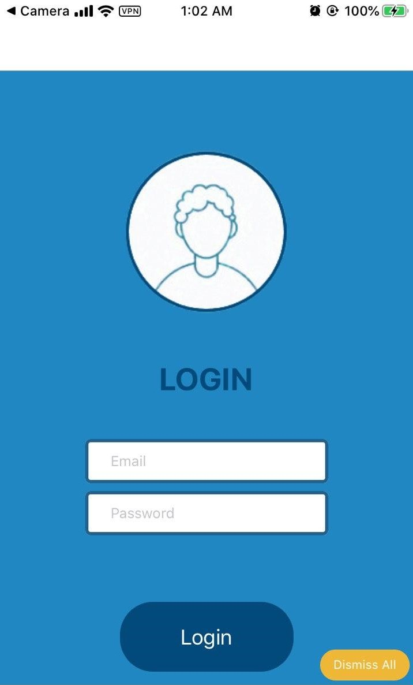
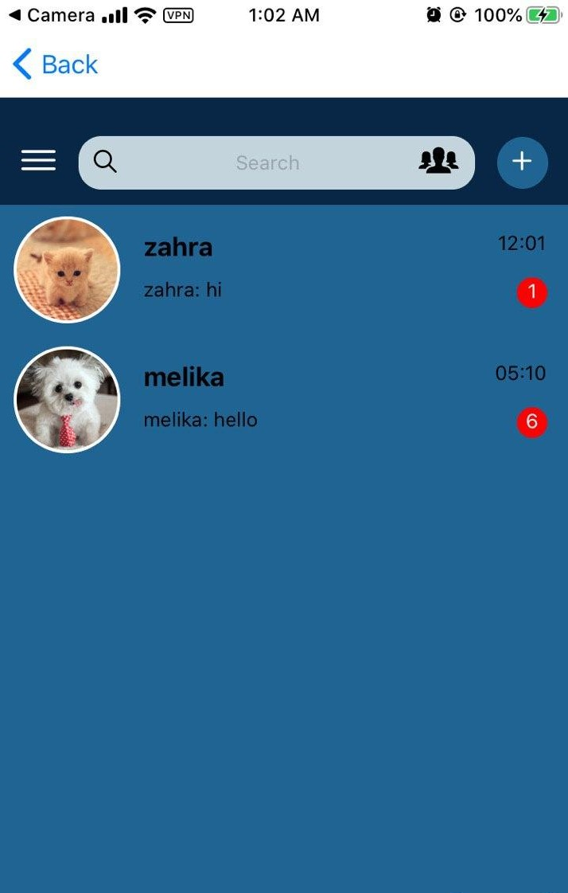
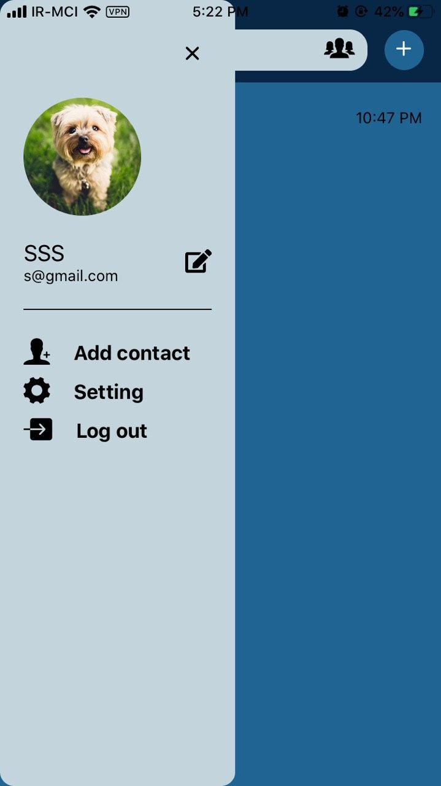
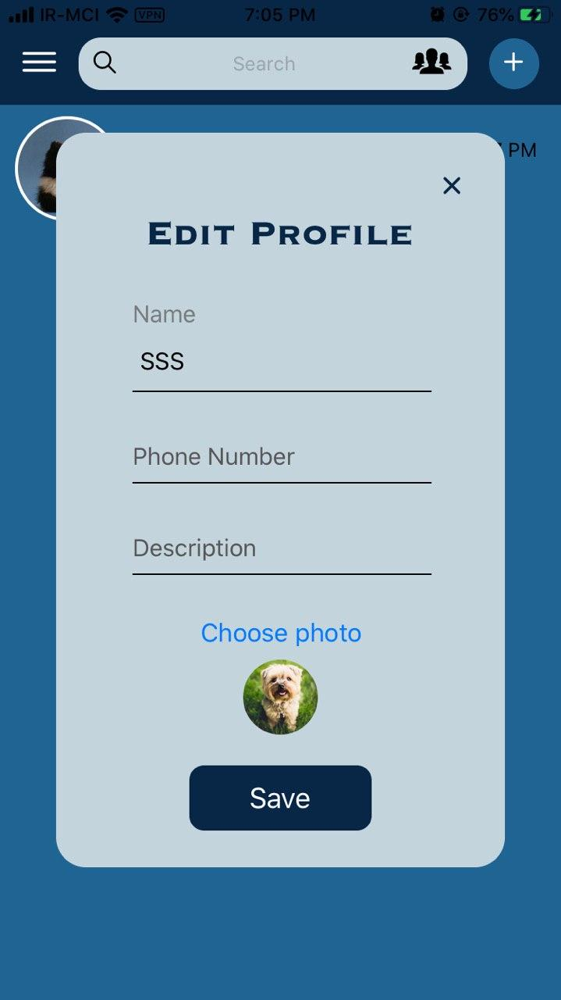

# React-Native-Messenger
Simple React Native Messenger
 
 

 
 

<h2> Features </h2>
<ul>
  <li> Login page </li>
  <li> Search in chats </li>
  <li> Add new contact </li>
  <li> Find contact by username </li>
  <li> Seen all messages </li>
  <li> Edit profile </li>
  <li> View contact profile </li>
  <li> Showing the number of unread messages for each conversation </li>
</ul>
